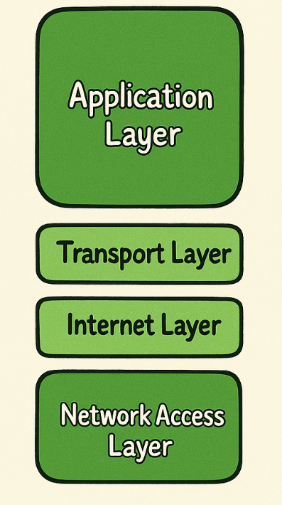

<div align="center">

# **`PCAP2TS`** | PCAP to [Time Series](https://wikipedia.org/wiki/Time_series) Extractor
</div>

[]()
[]()
<p align="center">
    <a href="https://github.com/cybersecurity-dev/"></a>
    &nbsp;
    <a href="https://www.youtube.com/@CyberThreatDefence"></a>
    &nbsp;
    <a href="https://cyberthreatdefence.com/my_awesome_lists"></a>
    
</p>

<details>

<summary>Install required tools on Linux</summary>

### For Ubuntu 18.04, 20.04, 22.04

```bash
sudo apt-get update
```
</details>


<details>

<summary>Install required python libs</summary>

### pip install
```bash
pip install -r requirements.txt
python3 setup.py install
```

### conda install
```bash
conda config --add channels conda-forge
conda install --file requirements_conda.txt
python3 setup.py install
```

</details>


## TCP/IP Model
<table>
  <tr>
    <td style="width: 25%; vertical-align: top;">
      
    </td>
    <td style="width: 75%;">
      <table border="1">
        <thead>
          <tr>
            <th>Layer</th>
            <th>Function</th>
            <th>Protocols</th>
          </tr>
        </thead>
        <tbody>
          <tr>
            <td>Application Layer</td>
            <td>Provides network services directly to end-user applications. It handles application-level protocols and interfaces with user software.</td>
            <td>HTTP, FTP, SMTP, DNS, RIP, SNMP</td>
          </tr>
          <tr>
            <td>Transport Layer</td>
            <td>Manages end-to-end communication and data transfer reliability. It is responsible for error recovery, flow control, and ensuring data integrity.</td>
            <td>TCP, UDP</td>
          </tr>
          <tr>
            <td>Internet Layer</td>
            <td>Handles logical addressing and routing of data packets across the network. It determines the best path for data from the source to the destination.</td>
            <td>IP, ARP, ICMP, IGMP</td>
          </tr>
          <tr>
            <td>Network Access Layer</td>
            <td>Manages physical network hardware and data framing. It handles the communication between devices on the same network segment and provides error detection.</td>
            <td>Ethernet, PPP</td>
          </tr>
        </tbody>
      </table>
    </td>
  </tr>
</table>

